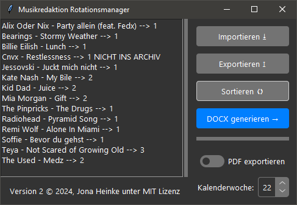

# Musikredaktion Rotationsmanager



## Releases

Für fertige installierbare Versionen des Programms, siehe [Releases](https://github.com/jonaheinke/mredak-musik-manager/releases/latest/).

## Installation / Starten des Codebase

```bash
git clone ...
cd ...
# WICHTIG: hier template.docx erstellen
pip3 install -r requirements.txt
python3 main.py
```